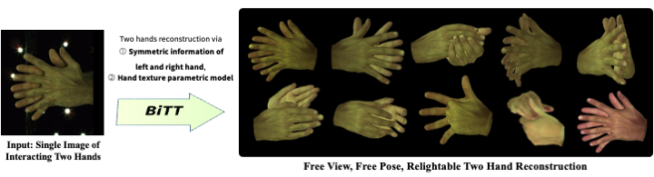

# BiTT: Bi-directional Texture Reconstruction of Interacting Two Hands from a Single Image
### CVPR 2024


[Minje Kim](https://yunminjin2.github.io), [Tae-Kyun Kim](https://sites.google.com/view/tkkim/home)

[](https://yunminjin2.github.io/projects/bitt/)
[](https://arxiv.org/pdf/2403.08262.pdf)
<p align='center'>
    
</p>

> Creating personalized hand avatars is important to of- fer a realistic experience to users on AR / VR platforms. While most prior studies focused on reconstructing 3D hand shapes, some recent work has tackled the reconstruction of hand textures on top of shapes. However, these meth- ods are often limited to capturing pixels on the visible side of a hand, requiring diverse views of the hand in a video or multiple images as input. In this paper, we pro- pose a novel method, BiTT(Bi-directional Texture recon- struction of Two hands), which is the first end-to-end train- able method for relightable, pose-free texture reconstruc- tion of two interacting hands taking only a single RGB im- age, by three novel components: 1) bi-directional (left ↔ right) texture reconstruction using the texture symmetry of left / right hands, 2) utilizing a texture parametric model for hand texture recovery, and 3) the overall coarse-to-fine stage pipeline for reconstructing personalized texture of two interacting hands. BiTT first estimates the scene light con- dition and albedo image from an input image, then recon- structs the texture of both hands through the texture para- metric model and bi-directional texture reconstructor. In ex- periments using InterHand2.6M and RGB2Hands datasets, our method significantly outperforms state-of-the-art hand texture reconstruction methods quantitatively and qualita-
tively. 

&nbsp;

## Environment Setup

Clone this repository and create conda environment through environments.yaml
<pre><code> git clone https://github.com/yunminjin2/BiTT.git
 mv BiTT </code></pre>

You can install environments either using conda or pip.

### Conda Install
1. Create conda environment using following command.
<pre><code> conda env create -f environment.yaml </code></pre>


### Pip Install
1. First, we install pytorch version 1.x.0. Please install torch version 1.x.0 with correspoding to you CUDA version (You can check torch versions at [here](https://pytorch.org/get-started/previous-versions/)). Following command are used in our work. 
<pre><code> pip install torch==1.11.0+cu113 torchvision==0.12.0+cu113 torchaudio==0.11.0 --extra-index-url https://download.pytorch.org/whl/cu113
 </code></pre>

2. Second, install [Pytorch3D](https://pytorch3d.org/) referencing [`INSTALL.md`](https://github.com/facebookresearch/pytorch3d/blob/main/INSTALL.md). Following command are used in our work. 
<pre><code> pip install "git+https://github.com/facebookresearch/pytorch3d.git"</code></pre>

3. Finally, install python libraries using following command.
<pre><code> pip install -r requirements.txt</code></pre>


**[!Required]** <b>Our model mainly utilizes hand texture parametric model ([HTML](https://handtracker.mpi-inf.mpg.de/projects/HandTextureModel/)). You need to get download HTML files from [its official website](https://handtracker.mpi-inf.mpg.de/projects/HandTextureModel/) and put it into `HTML` folder. </b>

**[Optional]** Follow [IntagHand](https://github.com/Dw1010/IntagHand.git) instructions for installing intaghand method. It is required when using instead of ground truth mesh. You need to put pre-trained model and data in `misc` folder, same as to their instruction.

&nbsp;

## Demo

As our model has ease on training (requires only one image, (annotation)), we provide demo version. You can easily train our model with following command. 

<pre><code> python main.py --custom --gpu 0 --train --test --img demo/01.jpg --hand_dict demo/01.pkl --pose demo/02.jpg --pose_dict demo/02.pkl </code></pre>


&nbsp;

## Data Preparation for training

1. Download InterHand2.6M dataset from [its official website](https://mks0601.github.io/InterHand2.6M/). 
2. To preprocess the dataset, type following command. 
    <pre><code> python dataset/interhand_for_bitt.py --data_path PATH_TO_INTERHAND2.6M --save_path PATH_TO_SAVE </code></pre>
3. After, preprocessing, change the value `INTERHAND_PATH` in `interhand_configs.yaml` to value that used on `PATH_TO_SAVE`.

4. (Rgb2Hands) For RGB2Hands training, we do not need preprocessing. 

&nbsp;

## Training & Evaluation
After processing dataset, you can train our model with following command. While training, evaluation automatically operates, so there are no typical commands for evaluation.

### Training InterHand2.6M
<pre><code> python main.py --cfg utils/interhand_configs.yaml --gpu 0 </code></pre>

### Training RGB2Hands
<pre><code> python main.py --cfg utils/rgb2hands_configs.yaml --gpu 0 </code></pre>

&nbsp;


## Citation

If you find this work useful, please consider citing our paper.

```
@InProceedings{kim2024bitt,
    author = {Kim, Minje and Kim, Tae-Kyun},
    title = {BiTT: Bi-directional Texture Reconstruction of Interacting Two Hands from a Single Image},
    booktitle = {The IEEE Conference on Computer Vision and Pattern Recognition (CVPR)},
    year = {2024}
}
```

&nbsp;

## Acknowledgements
 - Our code is based on [IntagHand](https://github.com/Dw1010/IntagHand). Our work uses [HTML](https://handtracker.mpi-inf.mpg.de/projects/HandTextureModel/) pre-trained weights. We thank the authors of these three inspiring works.
 - We also thank the authors of [InterHand2.6M](https://mks0601.github.io/InterHand2.6M/), [RGB2Hands](https://handtracker.mpi-inf.mpg.de/projects/RGB2Hands/Benchmark/RGB2HandsBenchmark.htm) for the useful dataset.
 - The renderer are based on the renderer from [Pytorch3D](https://pytorch3d.org/). 